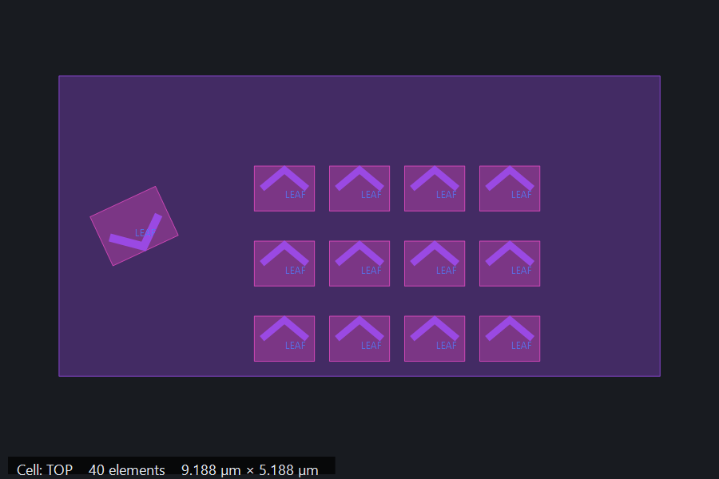

# GDS Preview for Windows Explorer

Preview GDSII layout files directly in the Windows Explorer preview pane.



GDS Preview for Windows Explorer is an x64 preview handler for `.gds` and `.gdsii` files. The
Explorer-facing COM DLL stays deliberately small: parsing and rasterization happen in a separate,
time-limited renderer process so malformed or unusually large layouts do not freeze Explorer.

[日本語](#日本語)

## Features

- GDSII `BOUNDARY`, `BOX`, `PATH`, `TEXT`, `SREF`, and `AREF`
- Cell hierarchy, translation, rotation, magnification, reflection, and arrays
- Automatic single-top-cell display and tiled overview for multiple top-level cells
- Layer/datatype coloring
- Dedicated `prevhost.exe` surrogate and isolated renderer process
- Cancellation, parser limits, hierarchy limits, and a six-second renderer timeout
- Per-user installation without administrator privileges

OASIS is not supported. A file with an OASIS payload and a `.gds` extension is reported as invalid
GDSII.

## Requirements

- Windows 10 or Windows 11, x64
- [.NET 8 Desktop Runtime, x64](https://dotnet.microsoft.com/download/dotnet/8.0)

## Install a release

1. Download `GDS-Preview-for-Windows-Explorer-<version>-x64.zip` from
   [Releases](https://github.com/keikawa/gds-preview-for-windows-explorer/releases).
2. Right-click the downloaded ZIP, open **Properties**, select **Unblock** if shown, and extract it.
3. Run `install.cmd`. The default installation applies only to the current user.
4. Close all Explorer windows, reopen Explorer, and enable the preview pane with `Alt+P`.

Run `uninstall.cmd` from the same package to remove it.

Files marked as downloaded from the Internet may show Windows' security warning instead of a
preview. This is Mark of the Web behavior enforced by Explorer before the preview handler starts.
For a trusted GDS file, use **Properties > Unblock**.

## Build from source

Build requirements:

- .NET 8 SDK
- Zig 0.15 or newer

From PowerShell at the repository root:

```powershell
powershell -ExecutionPolicy Bypass -File .\scripts\build.ps1
```

The build runs parser, load, COM isolation, timeout, and initial-resize regression tests. Output is
written under `artifacts\GdsPreview`.

Create a release ZIP after a successful build:

```powershell
powershell -ExecutionPolicy Bypass -File .\scripts\package.ps1 -Version 0.1.0-beta.1
```

## Architecture

- `src/GdsPreview.Core` — dependency-free GDSII parser and hierarchical scene builder
- `native/GdsPreview.Native.cpp` — minimal native COM preview handler loaded by `prevhost.exe`
- `src/GdsPreview.Renderer` — isolated .NET rasterizer process
- `tests/GdsPreview.Core.Tests` — regression and load tests without an external test framework
- `tools/GdsPreview.Sample` — deterministic GDSII sample generator
- `scripts` — build, package, install, verification, and uninstall commands

The handler implements `IInitializeWithFile`, `IPreviewHandler`, `IObjectWithSite`, `IOleWindow`, and
`IPreviewHandlerVisuals`. A dedicated AppID with `DllSurrogate=Prevhost.exe` isolates it from other
preview handlers. Parsing and GDI+ are loaded only by `GdsPreview.Renderer.exe`.

## Safety limits

Defaults are intentionally conservative to protect Explorer:

- File size: 2 GiB
- GDSII records: 10,000,000
- Retained geometry: 30,000 total and 4,000 per cell
- Retained vertices: 1,000,000 while parsing and 300,000 after hierarchy expansion
- Rendered primitives: 8,000
- Expanded instances: 8,000
- Hierarchy depth: 48
- Text labels: 200
- Independent top-level cells in an overview: 16
- Renderer time: 6 seconds

Large arrays are sampled. Omitted cell geometry is represented by its bounds, and the status line
shows `simplified` whenever limits affected the preview.

## License

[MIT](LICENSE)

## 日本語

Windows 10/11 x64のエクスプローラーで、`.gds`／`.gdsii`を選択したときに半導体・フォトニクス
レイアウトをプレビューペインへ表示します。

Explorer内ではGDSIIを解析しません。ネイティブCOM DLLは、時間制限付きの独立レンダラーから
共有メモリで完成画像だけを受け取るため、壊れたファイルや巨大なレイアウトがExplorer全体を
巻き込みにくい構成です。

配布版は[Releases](https://github.com/keikawa/gds-preview-for-windows-explorer/releases)からZIPを
取得し、ZIPのプロパティに「許可する」が表示される場合は解除してから展開し、`install.cmd`を
実行してください。インストール後はExplorerをすべて閉じて開き直し、`Alt+P`でプレビューペインを
表示します。通常のインストールは現在のユーザーだけが対象で、管理者権限は不要です。

## Security

Please report vulnerabilities privately as described in [SECURITY.md](SECURITY.md).
